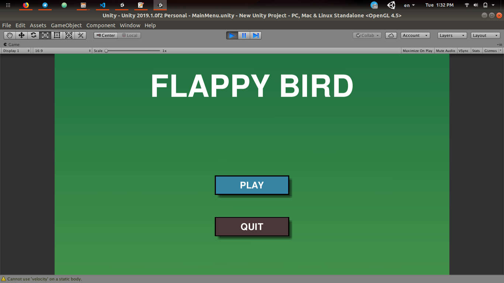
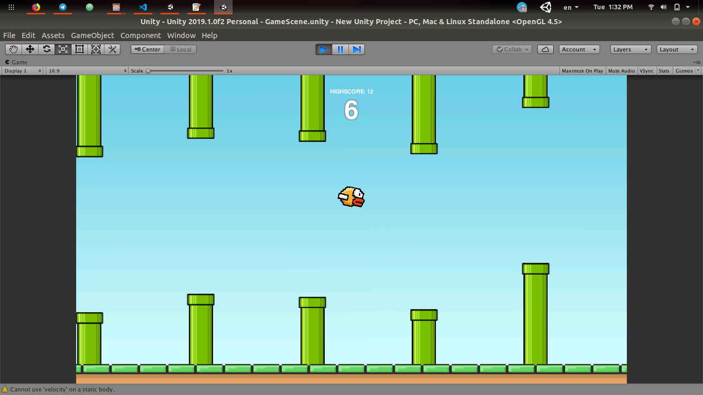
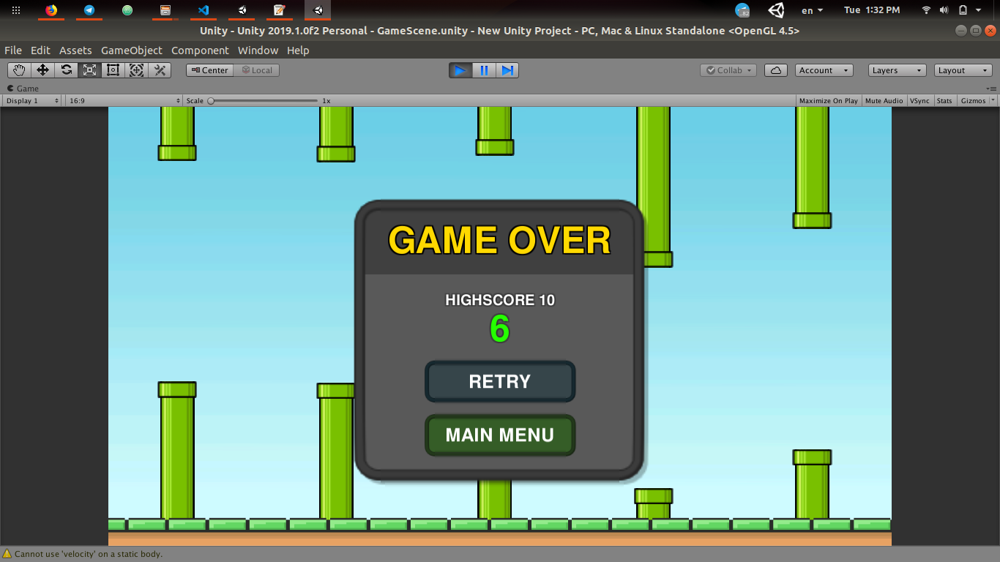

# Flappy Bird Clone

This is a flappy bird clone which I created by following tutorials. This was implemented using C# and unity3D engine, one thing to note is there appears to be a disadvantage to using unity3D on Ubuntu. It's a bit glitchy i.e. there will be instances whereby while playing the game, the bird's sprite will flash (proportional to the animation frames set). However, there will be cases where the bird's sprite and pipes' bodies doesn't render properly. Occasionally though, the bird's sprite renders properly as well as the pipes.

-   Basic Main Menu GUI of Flappy Bird
    

-   Game Play of Flappy Bird
    

-   Game Over Pop up of Flappy Bird
    
